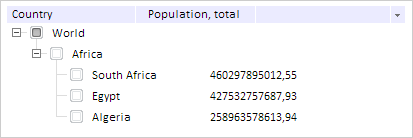

# TreeColumn.reduceCaptionWidthBy

TreeColumn.reduceCaptionWidthBy
-

# TreeColumn.reduceCaptionWidthBy

## Синтаксис

reduceCaptionWidthBy(value: Number);

## Параметры

value. Значение, на которое
 необходимо укоротить заголовок.

## Описание

Метод reduceCaptionWidthBy укорачивает
 заголовок столбца дерева, не влияя на ширину содержимого столбца.

## Пример

Для выполнения примера предполагается наличие на странице компонента
 [TreeList](../../Components/TreeList/TreeList.htm) c наименованием
 «treeList» (см. «[Пример
 создания компонента TreeList](../../Components/TreeList/TreeList_example.htm)»). Установим ширину видимой части первого
 столбца:

// Устанавливаем ширину видимой части первого столбца
treeList.getColumns().getItem(0).setVisibleWidth(200);
Уменьшаем ширину заголовка первого столбца на 50 пикселей и проверяем,
 было ли произведено уменьшение ширины заголовка:

// Уменьшаем ширину заголовка столбца
treeList.getColumns().getItem(0).reduceCaptionWidthBy(70);
// Проверяем, было ли произведено уменьшение ширины заголовка
if (treeList.getColumns().getItem(0).isCaptionReduced()) {
    console.log("Была уменьшена ширина заголовка");
    console.log("Ширина заголовка: " + treeList.getColumns().getItem(0).getCaptionWidth());
} else {
    console.log("Ширина заголовка уменьшена не была");
}
// Обновляем содержимое столбца
treeList.getColumns().getItem(0).updateContent();
В результате ширина заголовка будет меньше ширины содержимого:

В консоль будет выведена информация об уменьшении ширины заголовка первого
 столбца:

Была уменьшена ширина заголовка

Ширина заголовка: 130

См. также:

[TreeColumn](TreeColumn.htm)

		Справочная
		 система на версию 10.9
		 от 18/08/2025,
		 © ООО «ФОРСАЙТ»,
