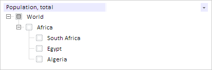
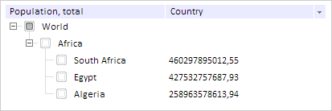

# TreeColumn.removeFromDom

TreeColumn.removeFromDom
-

# TreeColumn.removeFromDom

## Синтаксис

removeFromDom();

## Описание

Метод removeFromDom удаляет
 столбец из DOM-структуры дерева.

## Пример

Для выполнения примера предполагается наличие на странице компонента
 [TreeList](../../Components/TreeList/TreeList.htm) c наименованием
 «treeList» (см. «[Пример
 создания компонента TreeList](../../Components/TreeList/TreeList_example.htm)»). Удалим второй столбец из DOM-структуры
 дерева:

// Устанавливаем ширину видимой части второго столбца
treeList.getColumns().getItem(1).setVisibleWidth(200);
// Удаляем второй столбец из DOM-структуры
treeList.getColumns().getItem(0).removeFormDom();
В результате второй столбец будет удален из DOM-структуры дерева:

Добавим второй столбец в DOM-структуру дерева:

// Добавляем второй столбец в DOM-структуру дерева:
treeList.getColumns().getItem(0).appendToDom();
В результате столбец будет добавлен в DOM-структуру дерева:

См. также:

[TreeColumn](TreeColumn.htm)

		Справочная
		 система на версию 10.9
		 от 18/08/2025,
		 © ООО «ФОРСАЙТ»,
