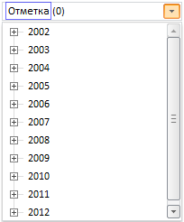

# TreeCombo.CaptionString

TreeCombo.CaptionString
-

# TreeCombo.CaptionString

## Синтаксис

CaptionString: String

## Описание

Свойство CaptionString устанавливает
 строку в текстовом поле, которая отображается перед количеством выделенных
 элементов.

## Комментарии

Данная строка отображается только при раскрытой панели, на рисунке ниже
 выделена синим:

См. также:

[TreeCombo](TreeCombo.htm)

		Справочная
		 система на версию 10.9
		 от 18/08/2025,
		 © ООО «ФОРСАЙТ»,
