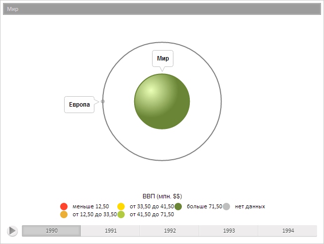

# TreeItem.ParentItem

TreeItem.ParentItem
-

**

# TreeItem.ParentItem

## Синтаксис

ParentItem: [PP.Ui.BubbleTreeItem](dhtmlBubbleTree.chm::/Classes/BubbleTreeItem/BubbleTreeItem.htm)
 | [PP.Ui.TreeMapItem](dhtmlBubbleTree.chm::/Classes/TreeMapItem/TreeMapItem.htm)

## Описание

Свойство ParentItem** определяет
 родительский элемент текущего элемента иерархической диаграммы.

## Комментарии

Значение свойства устанавливается из JSON и с помощью метода set**ParentItem**,
 а возвращается с помощью метода get**ParentItem**.

## Пример

Для выполнения примера предполагается наличие на странице компонента
 [BubbleTree](dhtmlBubbleTree.chm::/Components/BubbleTree/BubbleTree.htm)
с наименованием «bubbleTree» (см. «[Пример
 создания компонента BubbleTree](dhtmlBubbleTree.chm::/Components/BubbleTree/BubbleTree_Example.htm)» ). Получим элемент по идентификатору
 и его родительский элемент, изменим ориентацию метки родительского элемента
 и перерисуем его:

// Получим модель данных
var model = bubbleTree.getModel()
// Получим элемент по идентификатору
var item = model.getItem("EU");
// Получим родительский элемент
var parent = item.getParentItem();
// Изменим ориентацию метки родительского элемента
parent.setLabelSide(PP.Ui.BubbleTreeAlignment.Top)
// Перерисуем элемент
parent.draw()

В результате выполнения примера была изменена ориентация метки родительского
 элемента:

См. также:

[TreeItem](TreeItem.htm)

		Справочная
		 система на версию 10.9
		 от 18/08/2025,
		 © ООО «ФОРСАЙТ»,
