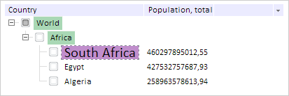

# TreeList.ActiveColor

TreeList.ActiveColor
-

# TreeList.ActiveColor

## Синтаксис

ActiveColor: PP.[Color](dhtmlCommon.chm::/Classes/PP/Color/Color.htm)
 | RGB |String

## Описание

Свойство ActiveColor определяет
 цвет активной вершины дерева.

## Комментарии

Значение свойства устанавливается из JSON и с помощью метода setActiveColor,
 а возвращается с помощью метода getActiveColor.

По умолчанию значение свойства равно #E4E4E4 (светло-серый цвет).

## Пример

Для выполнения примера предполагается наличие на странице компонента
 [TreeList](../../Components/TreeList/TreeList.htm) c наименованием
 «treeListSett» (см. «[Пример
 создания компонента TreeList](../../Components/TreeList/TreeList_example.htm)»). Меняем цвет, параметры шрифта
 и цвет всех родительских вершин активной вершины:

// Меняем цвет активной вершины на фиолетовый
treeListSett.setActiveColor("#A020F0");
// Меняем размер текста активной вершины на 20
treeListSett.setActiveFont(new PP.Font({ Size: 20 }));
// Меняем цвет родительских элементов активной вершины на зеленый
treeListSett.setActiveParentColor("#A9D8B5");
Нажимаем кнопкой мыши на вершину дерева с текстом «South Africa». В
 результате выделяемая вершина будет иметь фиолетовый цвет, 20 размер текста
 и все родительские вершины будут иметь зеленый цвет выделения:

Снимаем выделение со всех выделенных вершин:

//Снимаем выделение со всех выделенных вершин
treeList.clearSelection();
В результате в иерархическом дереве не будет выделенных вершин:

См. также:

[TreeList](TreeList.htm)

		Справочная
		 система на версию 10.9
		 от 18/08/2025,
		 © ООО «ФОРСАЙТ»,
