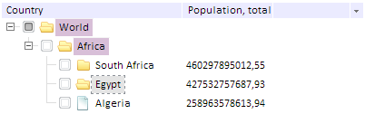

# TreeList.ActiveParentColor

TreeList.ActiveParentColor
-

# TreeList.ActiveParentColor

## Синтаксис

ActiveParentColor : PP.Color | RGB |String

## Описание

Свойство ActiveParentColor определяет
 цвет выделения родительских вершин активного элемента дерева.

## Пример

Для выполнения примера предполагается наличие на странице компонента
 [TreeList](../../Components/TreeList/TreeList.htm) с наименованием
 «treeListSett» (см. «[Пример
 создания компонента TreeList](../../Components/TreeList/TreeList_example.htm)»). Установим цвет выделения родительских
 вершин активного элемента дерева:

treeListSett.setActiveParentColor("Thistle");
После выполнения примера будут выделены родительские вершины активного
 элемента дерева:

 См. также:

[TreeList](TreeList.htm)

		Справочная
		 система на версию 10.9
		 от 18/08/2025,
		 © ООО «ФОРСАЙТ»,
