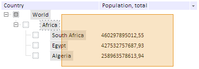

# TreeList.AreaSelect

TreeList.AreaSelect
-

# TreeList.AreaSelect

## Синтаксис

AreaSelect: Boolean

## Описание

Свойство AreaSelect определяет, доступно ли выделение области дерева мышью.

## Комментарии

Если для свойства установлено значение true ( по умолчанию), то выделение доступно:

При выделении области выделяются все входящие в эту область вершины дерева.

Если установлено значение false, то выделение области недоступно.

## Пример

Пример использования свойства приведен на странице «[Пример создания компонента TreeList](../../Components/TreeList/TreeList_example.htm)».

См. также:

[TreeList](TreeList.htm)

		Справочная
		 система на версию 10.9
		 от 18/08/2025,
		 © ООО «ФОРСАЙТ»,
