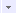

# TreeList.ColumnVisibilityChanging

TreeList.ColumnVisibilityChanging
-

# TreeList.ColumnVisibilityChanging

## Синтаксис

ColumnVisibilityChanging: function (sender, args);

## Параметры

sender. Источник
 события;

args. Информация
 о событии. Доступные аргументы: Column
 - индекс столбца, для которого была изменена видимость; Visibility - видимость столбца: true
 - столбец отображается, false - столбец скрыт; Cancel- признак отмены установки/снятия флажка
 для изменения видимости столбца: true - операция отменена, false
 (по умолчанию) - операция не отменена.

## Описание

Событие ColumnVisibilityChanging наступает
 при изменении видимости столбца дерева.

## Комментарии

Отображение заголовков столбцов доступно, если для свойства [TreeList.CaptionVisible](TreeList.CaptionVisible.htm)
 установлено значение true.

Чтобы отобразить/скрыть столбец дерева, нажмите на кнопку  в верхнем правом углу дерева
 и в раскрывающемся меню установите/снимите флажки для столбцов, которые
 необходимо отобразить/скрыть.

## Пример

Пример использования приведен в описании события [TreeList.ColumnVisibilityChanged](TreeList.ColumnVisibilityChanged.htm).

См. также:

[TreeList](TreeList.htm)

		Справочная
		 система на версию 10.9
		 от 18/08/2025,
		 © ООО «ФОРСАЙТ»,
