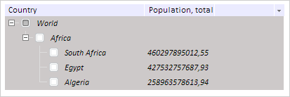

# TreeList.ContentColor

TreeList.ContentColor
-

# TreeList.ContentColor

## Синтаксис

ContentColor: PP.[Color](dhtmlCommon.chm::/Classes/PP/Color/Color.htm)
 | RGB | String

## Описание

Свойство ContentColor определяет
 цвет фона содержимого вершины дерева.

## Комментарии

Значение свойства устанавливается из JSON и с помощью метода setContentColor,
 а возвращается с помощью метода getContentColor.

По умолчанию значение свойства равно #FFFFFF (белый).

## Пример

Для выполнения примера предполагается наличие на странице компонента
 [TreeList](../../Components/TreeList/TreeList.htm) c наименованием
 «treeListSett» (см. «[Пример
 создания компонента TreeList](../../Components/TreeList/TreeList_example.htm)»). Меняем цвет фона компонента на серый,
 устанавливаем курсивное начертание для текста содержимого. Перерисовываем
 все дерево для установки внесенных изменений:

// Меняем цвет фона на серый
treeListSett.setContentColor("#CDC9C9");
// Устанавливаем курсивное начертание тексту содержимого
treeListSett.setContentFont(new PP.Font({
    IsItalic: true
});
// Перерисовываем дерево для установки изменений
treeListSett.redraw();
В результате цвет фона компонента будет серым, а текст содержимого будет
 выделен курсивом:

См. также:

[TreeList](TreeList.htm)

		Справочная
		 система на версию 10.9
		 от 18/08/2025,
		 © ООО «ФОРСАЙТ»,
