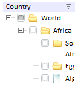
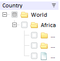

# TreeList.CutOverflow

TreeList.CutOverflow
-

# TreeList.CutOverflow

## Синтаксис

CutOverflow: Boolean

## Описание

Свойство CutOverflow определяет, нужно ли отображать многоточие на месте невмещающегося текста.

## Комментарии

Свойство актуально, если для свойств [TreeList.ShowColumns](TreeList.ShowColumns.htm) установлено значение false и для [TreeList.WordWrap](TreeList.WordWrap.htm) установлено значение true.

Если для свойства установлено значение true, то на месте невмещающегося текста будет отображаться многоточие, если установлено значение false (по умолчанию) - не будут.

## Пример

Для выполнения примера предполагается наличие на странице компонента [TreeList](../../Components/TreeList/TreeList.htm) с наименованием «treeListSett» (см. «[Пример создания компонента TreeList](../../Components/TreeList/TreeList_example.htm)»). Уменьшим ширину компонента, включим перенос по словам и отменим отображение столбцов:

//включаем возможность переноса текста

treeListSett.setWordWrap(true);

//Отключаем отображение столбцов

treeListSett.setShowColumns(false);

//уменьшим ширину компонента

treeListSett.setWidth(120);

Компонент примет следующий вид:

На месте невмещающегося текста отобразим многоточие:

treeListSett.setCutOverflow(true);

Компонент примет следующий вид:

См. также:

[TreeList](TreeList.htm)

		Справочная
		 система на версию 10.9
		 от 18/08/2025,
		 © ООО «ФОРСАЙТ»,
