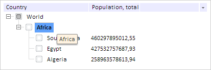
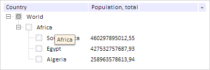

# TreeList.HoverColor

TreeList.HoverColor
-

# TreeList.HoverColor

## Синтаксис

HoverColor: PP.[Color](dhtmlCommon.chm::/Classes/PP/Color/Color.htm)
 | RGB |String

## Описание

Свойство HoverColor определяет
 цвет вершины дерева, на которую наведен курсор мыши.

## Комментарии

Значение свойства устанавливается из JSON и с помощью метода setHoverColor,
 а возвращается с помощью метода getHoverColor.

По умолчанию значение свойства равно #F8E3C5 (кремовый цвет).

## Пример

Для выполнения примера предполагается наличие на странице компонента
 [TreeList](../../Components/TreeList/TreeList.htm) c наименованием
 «treeListSett» (см. «[Пример
 создания компонента TreeList](../../Components/TreeList/TreeList_example.htm)»). Устанавливаем признак отображения
 подсказок и добавляем обработчик события отображения подсказки у вершины
 дерева:

// Устанавливаем признак отображения подсказок
treeListSett.setShowToopTips(true);
// Добавляем обработчик события отображения подсказки у вершины дерева
treeListSett.ToolTipShowing.add(function (sender, args) {
    console.log("Показывается подсказка вершины с содержимым: " + args.Node.getText());
});
Меняем цвет и параметры шрифта вершины при наведении на нее курсора
 мыши:

// Устанавливаем голубой цвет выделения вершины при наведении на нее курсора мыши
treeListSett.setHoverColor("#60A1FA");
// Устанавливаем полужирное начертание текста вершины при наведении на нее курсора мыши
treeListSett.setHoverFont(new PP.Font({ IsBold: true }));
Наведем курсор мыши на элемент с содержимым «Africa», в результате цвет
 вершины будет голубым, а текст будет полужирным:

Также в консоль будет выведено сообщение о том, что появилась всплывающая
 подсказка:

Показывается подсказка вершины с содержимым: Africa

Снимаем эффекты, появляющиеся у вершин при наведении на нее курсора
 мыши:

// Снимаем эффекты, появляющиеся у вершин при наведении на нее курсора мыши
treeListSett.removeHover();
В результате с вершины будут сняты эффекты:

См. также:

[TreeList](TreeList.htm)

		Справочная
		 система на версию 10.9
		 от 18/08/2025,
		 © ООО «ФОРСАЙТ»,
