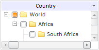

# TreeList.NodeHovered

TreeList.NodeHovered
-

# TreeList.NodeHovered

## Синтаксис

NodeHovered: function (sender,args)

## Параметры

sender. Источник события;

args. Информация о событии:
 [Node](../TreeNode/TreeNode.htm)
 - вершина, на которую наведен курсор.

## Описание

Событие NodeHovered наступает
 при наведении курсора на вершину.

## Пример

Для выполнения примера [создайте
 компонент](../../Components/TreeList/TreeList_example.htm) [TreeList](../../Components/TreeList/TreeList.htm)
 с наименованием «treeListSett». Добавим обработчик события NodeHovered:

treeListSett.NodeHovered.add(function
 (sender, args)

{

  treeListSett.setWidth(200);

  treeListSett.setHeight(100);

  treeListSett.getHorizontalScroll().setDraggerSize(20);

  treeListSett.getVerticalScroll().setEnabled(false);

});

После выполнения примера при наведении курсора на вершину изменятся
 размеры компонента, таким образом появятся полосы прокрутки. Для горизонтальной
 полосы будет установлена [ширина
 бегунка](dhtmlUi.chm::/Classes/scrollbar/scrollbar.draggersize.htm) в 20 пикселей. Вертикальная полоса будет [недоступной](dhtmlUi.chm::/Classes/control/control.enabled.htm)
 для пользователя:

См. также:

[TreeList](TreeList.htm)

		Справочная
		 система на версию 10.9
		 от 18/08/2025,
		 © ООО «ФОРСАЙТ»,
