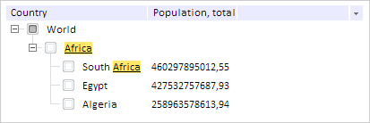

# TreeList.SearchColor

TreeList.SearchColor
-

# TreeList.SearchColor

## Синтаксис

SearchColor: PP.[Color](dhtmlCommon.chm::/Classes/PP/Color/Color.htm)
 | RGB |String

## Описание

Свойство SearchColor определяет
 цвет искомого текста.

## Комментарии

Значение свойства устанавливается из JSON и с помощью метода setSearchColor,
 а возвращается с помощью метода getSearchColor.

По умолчанию значение свойства равно #444 (серый цвет).

## Пример

Для выполнения примера предполагается наличие на странице компонента
 [TreeList](../../Components/TreeList/TreeList.htm) c наименованием
 «treeListSett» (см. «[Пример
 создания компонента TreeList](../../Components/TreeList/TreeList_example.htm)»). Меняем цвет находимого текста и параметры
 шрифта. Подсвечиваем текст вершины, с содержимым «Africa»:

// Устанавливаем желтый цвет вершины, найденной с помощью поиска
treeListSett.setSearchColor("#FFFF00");
// Устанавливаем подчеркивание текста, найденной вершины
treeListSett.setSearchFont(new PP.Font({ IsUnderline: true }));
// Подсвечиваем искомый текст вершин
treeListSett.highlight("Africa");
В результате будет подсвечен найденный текст во всех вершинах:

См. также:

[TreeList](TreeList.htm)

		Справочная
		 система на версию 10.9
		 от 18/08/2025,
		 © ООО «ФОРСАЙТ»,
