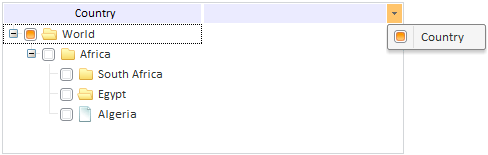

# TreeList.ShowColumns

TreeList.ShowColumns
-

# TreeList.ShowColumns

## Синтаксис

ShowColumns: Boolean

## Описание

Свойство ShowColumns определяет, отображаются ли столбцы.

## Комментарии

Если для свойства установлено значение true, столбцы отображаются, иначе - не отображаются. По умолчанию установлено значение true.

## Пример

Для выполнения примера [создайте компонент TreeList](../../Components/TreeList/TreeList_example.htm) с наименованием «treeListSett».

Значение свойства можно установить через JSON-объект:

TreeList: false

или на уровне API:

treeListSett.setShowColumns(false);

После выполнения примера в компоненте [TreeList](../../Components/TreeList/TreeList.htm) не будут отображаться колонки, при этом их названия не будут выводиться в раскрывающемся списке:

См. также:

[TreeList](TreeList.htm)

		Справочная
		 система на версию 10.9
		 от 18/08/2025,
		 © ООО «ФОРСАЙТ»,
