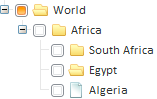

# TreeList.ShowLines

TreeList.ShowLines
-

# TreeList.ShowLines

## Синтаксис

ShowLines: Boolean

## Описание

Свойство ShowLines определяет, будут ли отображаться линии, соединяющие вершину с ее потомками.

## Комментарии

Если для свойства установлено значение true, линии отображаются, иначе - не отображаются. По умолчанию установлено значение true.

Сравните:

-
ShowLines: true:

-
ShowLines: false:

## Пример

Пример использования свойства приведен на странице «[Пример создания компонента TreeList](../../Components/TreeList/TreeList_example.htm)».

См. также:

[TreeList](TreeList.htm)

		Справочная
		 система на версию 10.9
		 от 18/08/2025,
		 © ООО «ФОРСАЙТ»,
