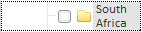
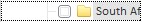

# TreeList.WordWrap

TreeList.WordWrap
-

# TreeList.WordWrap

## Синтаксис

WordWrap: Boolean

## Описание

Свойство WordWrap определяет, осуществляется ли перенос текста вершины по словам.

## Комментарии

Если для свойства установлено значение true, то при недостатке места происходит перенос наименований элементов дерева по словам. Иначе перенос не происходит. По умолчанию установлено значение false.

Сравните:

-
WordWrap: true:

-
WordWrap: false:

## Пример

Пример использования свойства приведен на странице «[Пример создания компонента TreeList](../../Components/TreeList/TreeList_example.htm)».

См. также:

[TreeList](TreeList.htm)

		Справочная
		 система на версию 10.9
		 от 18/08/2025,
		 © ООО «ФОРСАЙТ»,
