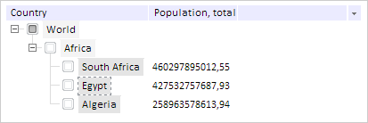
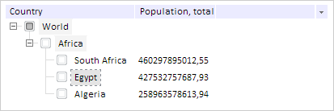

# TreeList.checkSelection

TreeList.checkSelection
-

# TreeList.checkSelection

## Синтаксис

checkSelection(fireEvents: Boolean);

## Параметры

fireEvents. Признак
 вызова событий, после выполнения метода. Чтобы события были вызваны параметр
 должен быть равен значению true, иначе - значению false.

## Описание

Метод checkSelection снимает
 выделение со всех вершин кроме последней выбранной.

## Комментарии

Метод используется при множественном выборе элементов, с помощью кнопки
 SHIFT.

Для работы метода необходимо включить множественный выбор, установив
 свойству [TreeList.IsCSMultiSelect](TreeList.IsCSMultiSelect.htm)
 значение true.

## Пример

Для выполнения примера предполагается наличие на странице компонента
 [TreeList](../../Components/TreeList/TreeList.htm) c наименованием
 «treeListSett» (см. «[Пример
 создания компонента TreeList](../../Components/TreeList/TreeList_example.htm)»). Устанавливаем признак множественного
 выделения вершин с помощью кнопки SHIFT:

// Устанавливаем признак множественного выделения вершин с помощью кнопки SHIFT
treeListSett.setIsCSMultiSelect(true);
Выделяем несколько вершин:

Снимаем выделения со всех элементов, кроме последнего выделенного:

// Снимаем выделения со всех элементов, кроме последнего выделенного
treeListSett.checkSelection();
В результате в дереве будет выделен только один элемент, который был
 выбран последним:

См. также:

[TreeList](TreeList.htm)

		Справочная
		 система на версию 10.9
		 от 18/08/2025,
		 © ООО «ФОРСАЙТ»,
