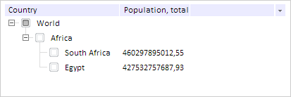

# TreeList.deleteNode

TreeList.deleteNode
-

# TreeList.deleteNode

## Синтаксис

deleteNode(node: PP.Ui.[TreeNode](../TreeNode/TreeNode.htm));

## Параметры

node. Удаляемая вершина.

## Описание

Метод deleteNode удаляет вершину
 иерархического дерева.

## Пример

Для выполнения примера предполагается наличие на странице компонента
 [TreeList](../../Components/TreeList/TreeList.htm) c наименованием
 «treeListSett» (см. «[Пример
 создания компонента TreeList](../../Components/TreeList/TreeList_example.htm)»). Удаляем вершину с содержимым «Algeria»:

// Удаляем элемент, содержащий текст «Algeria»
treeListSett.deleteNode(treeList.findText("Algeria"));
В результате из иерархического дерева будет удалена вершина с содержимым
 «Algeria»:

См. также:

[TreeList](TreeList.htm)

		Справочная
		 система на версию 10.9
		 от 18/08/2025,
		 © ООО «ФОРСАЙТ»,
