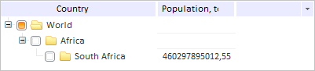

# TreeList.filter

TreeList.filter
-

# TreeList.filter

## Синтаксис

filter(value: String, column: Number, method: Function);

## Параметры

value. Значение, по которому будет осуществляться фильтрация;

number. Номер столбца в таблице иерархического дерева. Необязательный параметр;

method. Пользовательская функция для фильтрации элементов иерархического дерева. Необязательный параметр.

## Описание

Метод filter фильтрует вершины в иерархическом дереве.

## Пример

Для выполнения примера предполагается наличие на странице компонента [TreeList](../../Components/TreeList/TreeList.htm) с наименованием «treeListSett» (см. страницу «[Пример создания компонента TreeList](../../Components/TreeList/TreeList_example.htm)»). Оставим в дереве вершины, названия которых начинаются с буквы «S», а также их родительские вершины:

// Зададим функцию фильтрации
var filterMethod = function (treeNode, value, column) {
    // Получим первую букву названия вершины дерева
    var firstLetter = treeNode.getText().charAt(0);
    // Проверим равенство полученной буквы на желаемой
    if (firstLetter == value) {
        return true
    } else {
        return false;
    }
};
// Оставим вершины дерева, начинающиеся с буквы «S», и их родителей
treeListSett.filter("S", 0, filterMethod);

В результате выполнения примера в дереве останутся только те вершины, названия которых начинаются с буквы «S», а также их родительские вершины:

См. также:

[TreeList](TreeList.htm)

		Справочная
		 система на версию 10.9
		 от 18/08/2025,
		 © ООО «ФОРСАЙТ»,
