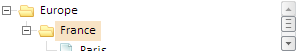

# TreeList.scrollToNode

TreeList.scrollToNode
-

# TreeList.scrollToNode

## Синтаксис

scrollToNode (treeNode: PP.Ui.[TreeNode](../TreeNode/TreeNode.htm), bottom: Boolean);

## Параметры

treeNode. [Вершина](../TreeNode/TreeNode.htm), до которой будет осуществляться прокрутка;

bottom. Определяет, размещать ли внизу. Если установлено значение true, вершина не будет размещаться внизу дерева. По умолчанию установлено значение false.

## Описание

Метод scrollToNode осуществляет прокрутку дерева до указанной вершины.

## Пример

Для выполнения примера предполагается наличие на странице компонента [TreeList](../../Components/TreeList/TreeList.htm) с наименованием «treeListSett» (см. пример события [TreeList.NodeUnHovered](TreeList.NodeUnHovered.htm)). Уменьшим высоту дерева, раскроем его вершины и осуществим прокрутку до вершины с индексом 1:

treeList.setHeight(50); //уменьшаем высоту дерева
treeList.setExpandedByKeys(["n1", "n2"]); //разворачиваем указанные вершины
treeList.scrollToNode(treeList.getAllNodes(true)[1], true); //прокрутка до указанной вершины (указанная вершина будет смещена к низу дерева, насколько возможно)
treeList.setHoveredNode(treeList.getVisibleNodes()[1]); //курсор на последней вершине
console.log(treeList.getVisibleNodesCount());//выводим в консоль количество выделенных вершин

После выполнения примера компонент будет иметь следующий вид:

В консоль браузера будет выведено значение 2.45 - количество видимых вершин.

См. также:

[TreeList](TreeList.htm)

		Справочная
		 система на версию 10.9
		 от 18/08/2025,
		 © ООО «ФОРСАЙТ»,
