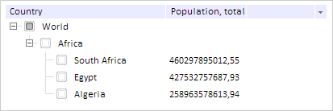

# TreeList.setExpandedForNode

TreeList.setExpandedForNode
-

# TreeList.setExpandedForNode

## Синтаксис

deleteNode(node: PP.Ui.[TreeNode](../TreeNode/TreeNode.htm),
 value: Boolean);

## Параметры

node. Вершина,у которой меняется
 видимость дочерних вершин;

value. Передаваемое значение
 открытости вершины. Если значение параметра true,
 то вершина откроется, если false,
 то вершина скроется.

## Описание

Метод setExpandedForNode открывает
 или скрывает вершину, в зависимости от переданного значения.

## Пример

Для выполнения примера предполагается наличие на странице компонента
 [TreeList](../../Components/TreeList/TreeList.htm) c наименованием
 «treeListSett» (см. «[Пример
 создания компонента TreeList](../../Components/TreeList/TreeList_example.htm)»). Открываем корневую вершину с индексом
 0:

// Раскрываем корневую вершину с индексом 0
treeListSett.setExpandedForNode(treeList.getNodes().getItem(0), true);
В результате будет открыта корневая вершина с индексом 0:

См. также:

[TreeList](TreeList.htm)

		Справочная
		 система на версию 10.9
		 от 18/08/2025,
		 © ООО «ФОРСАЙТ»,
