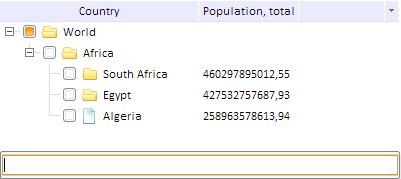

# TreeList.showSearch

TreeList.showSearch
-

# TreeList.showSearch

## Синтаксис

showSearch ();

## Описание

Метод showSearch открывает строку поиска.

## Пример

Для выполнения примера предполагается наличие на странице компонента [TreeList](../../Components/TreeList/TreeList.htm) с наименованием «treeListSett» (см. «[Пример создания компонента TreeList](../../Components/TreeList/TreeList_example.htm)»). Откроем стоку поиска и добавим обработчик события [TreeList.Finding](TreeList.Finding.htm):

treeListSett.showSearch();
treeListSett.Finding.add(function (sender, args)
{
    console.log("Индекс первого видимого элемента: " + treeListSett.getFirstVisibleIndex()//индекс первого видмого элемента
                + "; Второй уровень: " + treeListSett.getHasSecondLevel()//есть ли второй уровень
                + "; Отступ сверху: " + treeListSett.getTopMargin()//отступ сверху
                + "; Смещение сверху: " + treeListSett.getTopShift())//смещение сверху
});
treeListSett.removeFocus();//удаляет фокус с элемента

После выполнения примера откроется строка поиска:

Введите в строку поиска искомое значение и нажмите ENTER. При этом сгенерируется событие [TreeList.Finding](TreeList.Finding.htm):в консоль будет выведено:

Индекс первого видимого элемента: 0; Второй уровень: true; Отступ сверху: 0; Смещение сверху: 0

С найденного элемента будет удален фокус.

См. также:

[TreeList](TreeList.htm)

		Справочная
		 система на версию 10.9
		 от 18/08/2025,
		 © ООО «ФОРСАЙТ»,
