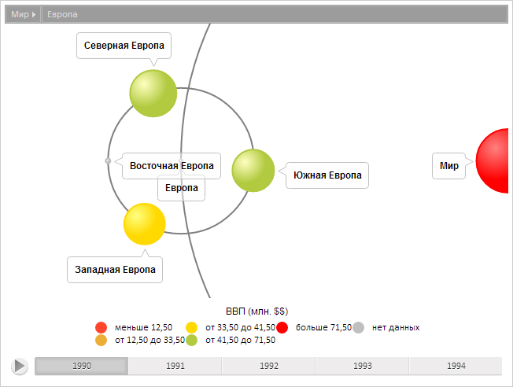
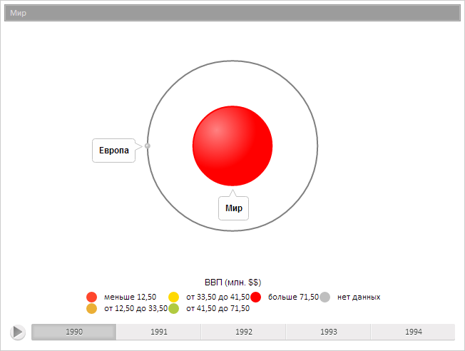

# TreeModel.ActiveItem

TreeModel.ActiveItem
-

**

# TreeModel.ActiveItem

## Синтаксис

ActiveItem: [PP.Ui.TreeItem](../TreeItem/TreeItem.htm)

## Описание

Свойство ActiveItem** определяет
 активный элемент модели данных диаграммы.

## Комментарии

Значение свойства устанавливается из JSON и с помощью метода set**ActiveItem**,
 а возвращается с помощью метода get**ActiveItem**.

## Пример

Для выполнения примера предполагается наличие на странице компонента
 [BubbleTree](dhtmlBubbleTree.chm::/Components/BubbleTree/BubbleTree.htm)
 с наименованием «bubbleTree» (см. «[Пример
 создания компонента BubbleTree](dhtmlBubbleTree.chm::/Components/BubbleTree/BubbleTree_Example.htm)» ). Получим модель данных,
 обработаем событие [ActiveItemChanged](TreeModel.ActiveItemChanged.htm),
 установим новый активный элемент, обновим индексы элементов, изменим цвет
 корневого элемента:

// Получим модель данных
var model = bubbleTree.getModel()
// Обработаем событие ActiveItemChanged
model.ActiveItemChanged.add(function (sender, args, timeout) {
    console.log("Инициировано событие ActiveItemChanged")
});
// Получим элемент по идентификатору
var item = model.getItem("EU");
// Установим новый активный элемент
model.setActiveItem(item);
// Обновим индексы элементов
model.buildIndex();
// Получим корневой элемент диаграммы
var rootItem = model.getRootItem();
// Получим кисть закраски элемента
var brush = rootItem.getColor();
// Изменим цвет закраски
brush.setColor("#FF0000");
// Установим новую кисть
rootItem.setColor(brush);
// Обновим цвета
rootItem.updateColors();
// Установим новый корневой элемент
model.setRootItem(rootItem);
// Обновим диаграмму
bubbleTree.refresh();

В результате был установлен новый активный элемент, был изменен цвет
 корневого элемента:

Также в консоли браузера было выведено сообщение о вызове обработанного
 события:

Инициировано событие ActiveItemChanged

Заменим текущий активный элемент на его родительский элемент:

// Сделаем активным родительский элемент текущего активного элемента
model.goToParent();
// Обновим диаграмму
bubbleTree.refresh();
В результате был изменен активный элемент:

См. также:

[TreeModel](TreeModel.htm)

		Справочная
		 система на версию 10.9
		 от 18/08/2025,
		 © ООО «ФОРСАЙТ»,
