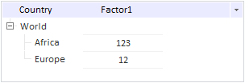

# Конструктор TreeNode

Конструктор TreeNode
-

# Конструктор TreeNode

## Синтаксис

PP.Ui.TreeNode(settings);

## Параметры

settings. JSON-объект со значениями
 свойств компонента.

## Описание

Конструктор TreeNode создает
 экземпляр класса [TreeNode](TreeNode.htm).

## Пример

Для выполнения примера в теге HEAD подключите ссылки на библиотеку компонентов
 PP.js и таблицы визуальных стилей PP.css.

var treeList = new PP.Ui.TreeList({
   ParentNode: document.getElementById("treelist"),
   ShowColumns: true,
   CaptionVisible: true,
   Columns: [{
      Caption: "Country",
      Width: 100,
      MinWidth: 50,
      Visible: true
   }, {
      Caption: "Factor1",
      Width: 100,
      MinWidth: 50,
      Visible: true
   }],
   Width: 300,
   Height: 100,
   Nodes: [{
      Text: "World",
      Expanded: true,
      Columns: [],
      Nodes: [{
         Text: "Africa",
         Columns: ["123"]
      }]
   }]
});
// Добавляем для первой вершины дочерний элемент
treeList.getNodes().getItem(0).getNodes().insertNode(new PP.Ui.TreeNode({
    Text: "Europe",
    Columns: ["12"],
    // Устанавливаем данные
    Data: "Данные",
    // Устанавливаем значение
    Value: "Новое значение",
    // Устанавливаем ключ к ресурсу
    ResourceKey: "Europe",
    // Устанавливаем видимость вершины
    Visible: true
}));
После выполнения примера на html-странице будет размещен компонент TreeList,
 имеющий следующий вид:

См. также:

[TreeNode](TreeNode.htm)

		Справочная
		 система на версию 10.9
		 от 18/08/2025,
		 © ООО «ФОРСАЙТ»,
