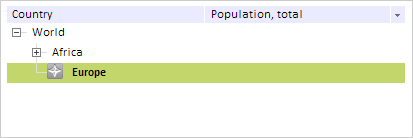
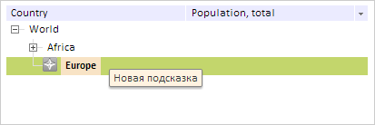

# TreeNode.Color

TreeNode.Color
-

# TreeNode.Color

## Синтаксис

Color: PP.[Color](dhtmlCommon.chm::/Classes/PP/Color/Color.htm)
 | RGB |String

## Описание

Свойство Color определяет цвет
 вершины дерева.

## Комментарии

Значение свойства устанавливается из JSON и с помощью метода setColor,
 а возвращается с помощью метода getColor.

## Пример

Для выполнения примера предполагается наличие на странице компонента
 [TreeList](../../Components/TreeList/TreeList.htm) c наименованием
 «treeList» (см. «[Пример
 создания компонента TreeList](../../Components/TreeList/TreeList_example.htm)»). Создаем новую вершину и добавляем
 ее в дочерние элементы вершины с содержимым «World»:

// Создаем новую вершину
var newNode = new PP.Ui.TreeNode({
    // Устанавливаем цвет вершине
    Color: "#C3D66C",
    // Устанавливаем шрифт вершине
    Font: new PP.Font({ IsBold: true }),
    // Устанавливаем источник пиктограмм
    ImageUrl: "../build/img/app/icons16x16.png",
    // Устанавливаем текст всплывающей подсказки
    ToolTip: "Новая подсказка",
    Text: "Europe",
    Columns: ["1", "1", "1"],
});
// Добавляем вершину в дерево
treeList.getNodes().getItem(0).getNodes().insertNode(newNode);
В результате в дерево будет добавлена новая вершина с пиктограммой:

Наведем курсор мыши на первый элемент. В результате появится всплывающая
 подсказка с новым значение:

См. также:

[TreeNode](TreeNode.htm)

		Справочная
		 система на версию 10.9
		 от 18/08/2025,
		 © ООО «ФОРСАЙТ»,
