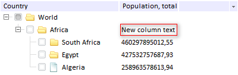

# TreeNode.ColumnText

TreeNode.ColumnText
-

# TreeNode.ColumnText

## Синтаксис

ColumnText: String

## Описание

Свойство ColumnText устанавливает содержимое вершины для указанного столбца.

## Комментарии

Значение свойства устанавливается при помощи метода setColumnText (column, value) с параметрами:

-
column - индекс столбца, нумерация начинается с 0;

-
value - устанавливаемое значение.

Значение свойства устанавливается при помощи метода getColumnText (column) с параметром column - индекс столбца, нумерация начинается с 0.

## Пример

Для выполнения примера предполагается наличие на странице компонента [TreeList](../../Components/TreeList/TreeList.htm) с наименованием «treeListSett» (см. «[Пример создания компонента TreeList](../../Components/TreeList/TreeList_example.htm)»). Установим содержимое для второго столбца второй вершины дерева:

treeListSett.getNodeByIndex(1).setColumnText(1, "New column text");

После выполнения примера для второго столбца вершины «Africa» будет добавлен текст «New column text» (выделено красным на рисунке ниже):

См. также:

[TreeNode](TreeNode.htm)

		Справочная
		 система на версию 10.9
		 от 18/08/2025,
		 © ООО «ФОРСАЙТ»,
