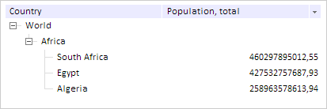
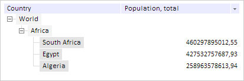

# TreeNode.collapseAll

TreeNode.collapseAll
-

# TreeNode.collapseAll

## Синтаксис

collapseAll();

## Описание

Метод collapseAll скрывает список
 дочерних элементов вершины.

## Пример

Для выполнения примера предполагается наличие на странице компонента
 [TreeList](../../Components/TreeList/TreeList.htm) c наименованием
 «treeListSett» (см. «[Пример
 создания компонента TreeList](../../Components/TreeList/TreeList_example.htm)»). Раскрываем список потомков вершины
 с содержимым «Africa»:

var nodeAfrica = treeListSett.find("Africa");
// Раскрываем список потомков вершины с содержимым «Africa»
nodeAfrica.expandAll();
В результате потомки вершины с содержимым «Africa» будут раскрыты:

Отмечаем всех потомков вершины с содержимым «Africa»:

// Отмечаем всех потомков вершины с содержимым «Africa»
nodeAfrica.selectChild();
В результате все потомки вершины с содержимым «Africa» будут отмечены:

Снимаем отметку со всех потомков вершины с содержимым «Africa»:

// Снимаем отметку со всех потомков вершины с содержимым "Africa»
nodeAfrica.deSelectChild();
В результате отметка будет снята со всех потомков вершины с содержимым
 «Africa».

Скрываем потомков вершины с содержимым «Africa»:

// Скрываем потомков вершины с содержимым «Africa»
nodeAfrica.collapseAll();
В результате потомки вершины с содержимым «Africa» будут скрыты.

См. также:

[TreeNode](TreeNode.htm)

		Справочная
		 система на версию 10.9
		 от 18/08/2025,
		 © ООО «ФОРСАЙТ»,
