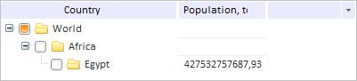

# TreeNodes.FilterColumn

TreeNodes.FilterColumn
-

# TreeNodes.FilterColumn

## Синтаксис

FilterColumn: Number;

## Описание

Свойство FilterColumn определяет индекс столбца, по данным которого в иерархическом дереве осуществляется фильтрация вершин.

## Комментарии

Значение свойства устанавливается с помощью метода setFilterColumn. Из JSON значение задать нельзя.

## Пример

Для выполнения примера предполагается наличие на странице компонента [TreeList](../../Components/TreeList/TreeList.htm) с наименованием «treeListSett» (см. страницу «[Пример создания компонента TreeList](../../Components/TreeList/TreeList_example.htm)»). Оставим в дереве вершины, названия которых начинаются с буквы «E», а также их родительские вершины:

// Зададим функцию фильтрации
var filterMethod = function (treeNode, value, column) {
    // Получим первую букву названия вершины дерева
    var firstLetter = treeNode.getText().charAt(0);
    // Проверим равенство полученной буквы на желаемой
    if (firstLetter == value) {
        return true
    } else {
        return false;
    }
};
// Получим вершины дерева
var nodes = treeListSett.getNodes();
// Зададим индекс столбца для фильтрации
nodes.setFilterColumn(1);
// Зададим функцию фильтрации
nodes.setFilterMethod(filterMethod);
// Установим значение, по которому фильтруются вершины дерева
nodes.setFilterValue("E");

В результате выполнения примера в дереве останутся только те вершины, названия которых начинаются с буквы «E», а также их родительские вершины:

См. также:

[TreeNodes](TreeNodes.htm)

		Справочная
		 система на версию 10.9
		 от 18/08/2025,
		 © ООО «ФОРСАЙТ»,
