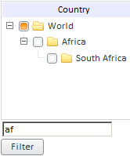

# TreeNodes.Filter

TreeNodes.Filter
-

# TreeNodes.Filter

## Синтаксис

Filter: String

## Параметры

text. Текст, по которому фильтруется коллекция вершин.

## Описание

Свойство Filter определяет текст, по которому будут фильтроваться вершины.

## Пример

Для выполнения примера [создайте компонент TreeList](../../Components/TreeList/TreeList_example.htm) с наименованием «treeList». Добавим поле ввода с идентификатором «text_filter» и кнопку с наименованием «Filter», при нажатии на которую будет осуществляться фильтрация элементов дерева по тексту в поле ввода:

<!--контейнер для поля ввода-->

<input id="filter_text" type="text" value="wwwww" />

<!--контейнер для кнопки-->

Добавим кнопку, при нажатии на которую будет осуществляться фильтрация:

function filter()

 {

    text = document.getElementById("filter_text");

    treeList.getNodes().setFilter(text.value);

 }

var but = new PP.Ui.Button(

 {

    ParentNode: "but",

    Content: "Filter"

 });

but.Click.add(filter);

После выполнения примера на html-страницу будут добавлены поле ввода и кнопка, при нажатии на которую выполняется фильтрация вершин компонента TreeList:

См. также:

[TreeNodes](TreeNodes.htm)

		Справочная
		 система на версию 10.9
		 от 18/08/2025,
		 © ООО «ФОРСАЙТ»,
