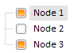

# TreeNodes.updateFrom

TreeNodes.updateFrom
-

# TreeNodes.updateFrom

## Синтаксис

updateFrom (jsonData)

## Параметры

jsonData. Массив
 JSON-объектов с полями, соответствующими свойствам класса PP.Ui.[TreeNode](../TreeNode/TreeNode.htm).

## Описание

Метод updateFrom вставляет массив
 элементов дерева в вершину, удаляя все ее дочерние вершины, и сохраняет
 состояние элементов (то есть установленные для них свойства), инициализируя
 их по [ключу](../TreeNode/TreeNode.Key.htm).

## Комментарии

Отличие метода updateFrom от
 [loadFrom](TreeNodes.loadFrom.htm) в том, что updateFrom
 вставляет элементы в том же порядке, как в JSON и, если совпадает
 [ключ](../TreeNode/TreeNode.Key.htm) у заменяемой вершины и
 исходной, то у вершины не изменится ни одно свойство, кроме [Text](../TreeNode/TreeNode.Text.htm),
 в то время как [loadFrom](TreeNodes.loadFrom.htm)
 выставит значения всех свойств по умолчанию, если они не указаны.

## Пример

Для выполнения примера предполагается наличие на странице компонента
 TreeList с наименованием «treeList»
 (см. «[Пример
 создания компонента TreeList](../../Components/TreeList/TreeList_example.htm)»). В переменной «newSettings» содержится
 JSON-объект с описанием вершин компонента:

Примечание.
 Для каждой вершины необходимо установить [ключ](../TreeNode/TreeNode.Key.htm).

var newSettings
 = [

 {

   Text: "Node
 1",

   Columns: ["10",
 "12", "34"],

   Selected: true,

   CanSelect: true,

   Checked: true,

   Key: 10

 },

 {

   Text: "Node
 2",

   Columns: ["12",
 "123", "33"],

   Selected: false,

   CanSelect: true,

   Checked: false,

   Key: 11

 },

 {

   Text: "Node
 3",

   Columns: ["33",
 "67", "65"],

   Selected: false,

   CanSelect: true,

   Checked: true,

   Key: 12

 }]

Обновим дерево:

treeList.getNodes().updateFrom(newSettings)

После выполнения примера дерево будет иметь следующий вид:

См. также:

[TreeNodes](TreeNodes.htm)

		Справочная
		 система на версию 10.9
		 от 18/08/2025,
		 © ООО «ФОРСАЙТ»,
