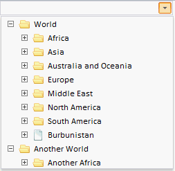

# TreeCombo

TreeCombo
-

**

# TreeCombo

## Описание

Компонент TreeCombo представляет
 собой элемент управления для отображения иерархий в виде раскрывающегося
 списка.

## Комментарии

Компонент реализован классом [TreeCombo](../../Classes/TreeCombo/TreeCombo.htm).

## Пример

Компонент имеет следующий вид:

В раскрывающейся части компонента отображается компонент [TreeList](../TreeList/TreeList.htm).

[Пример создания
 компонента TreeCombo](../../Classes/TreeCombo/TreeCombo_constructor.htm)

## Конструктор

		 Имя конструктора
		 Краткое описание

		 
		 [TreeCombo](dhtmlUiTree.chm::/Classes/TreeCombo/TreeCombo_constructor.htm)
		 Конструктор TreeCombo создает
		 экземпляр компонента TreeCombo.

## Свойства

		 Имя свойства
		 Краткое описание

		 
		 [AutoFillCaption](dhtmlUiTree.chm::/classes/treecombo/treecombo.autofillcaption.htm)
		 Свойство AutoFillCaption
		 определяет, отображается ли в заголовке компонента TreeCombo
		 наименование выделенной вершины дерева.

		 
		 [CaptionString](dhtmlUiTree.chm::/classes/treecombo/treecombo.captionstring.htm)
		 Свойство CaptionString
		 устанавливает строку в текстовом поле, которая отображается перед
		 количеством выделенных элементов.

		 
		 [CaptionStringNothing](dhtmlUiTree.chm::/classes/treecombo/treecombo.captionstringnothing.htm)
		 Свойство CaptionStringNothing
		 устанавливает строку, которая отображается в текстовом поле до
		 изменении отметки элементов дерева.

		 
		 [HideOnNodeClick](dhtmlUiTree.chm::/classes/treecombo/treecombo.hideonnodeclick.htm)
		 Свойство HideOnNodeClick
		 определяет, закрывается ли раскрывающаяся часть компонента TreeCombo при выборе вершины
		 дерева.

		 
		 [OpenToFocused](dhtmlUiTree.chm::/classes/treecombo/treecombo.opentofocused.htm)
		 Свойство OpenToFocused
		 определяет, будет ли прокручиваться раскрывающийся список при
		 открытии до фокусированного элемента.

		 
		 [OpenToSelected](dhtmlUiTree.chm::/Classes/TreeCombo/TreeCombo.OpenToSelected.htm)
		 Свойство OpenToSelected
		 определяет, будет ли прокручиваться раскрывающийся список при
		 открытии к первому выделенному элементу.

		 
		 [TreeList](dhtmlUiTree.chm::/classes/treecombo/treecombo.treelist.htm)
		 Свойство TreeList устанавливает
		 [иерархическую
		 структуру](dhtmlUiTree.chm::/components/treelist/treelist.htm) для раскрывающейся части компонента
		 TreeCombo.

## Методы

		 Имя метода
		 Краткое описание

		 
		 [showSearch](dhtmlUiTree.chm::/Classes/TreeCombo/TreeCombo.showSearch.htm)
		 Метод showSearch
		 отображает строку поиска по дереву.

		 
		 [updateCaption](dhtmlUiTree.chm::/Classes/TreeCombo/TreeCombo.updateCaption.htm)
		 Метод updateCaption
		 обновляет заголовок панели.

## Свойства, унаследованные от класса [Combo](dhtmlUi.chm::/Classes/Combo/Combo.htm)

		 Имя свойства
		 Краткое описание

		 
		 [CloseOnContentClick](dhtmlUi.chm::/Classes/Combo/Combo.CloseOnContentClick.htm)
		 Свойство CloseOnContentClick
		 определяет возможность закрытия панели компонента по нажатию на
		 заголовок.

		 
		 [EnableEdit](dhtmlUi.chm::/classes\combo\combo.enableedit.htm)
		 Свойство EnableEdit
		 устанавливает возможность ввода.

		 
		 [IsDropHasCombosWidth](dhtmlUi.chm::/Classes/Combo/Combo.IsDropHasCombosWidth.htm)
		 Свойство IsDropHasCombosWidth
		 устанавливает признак независимости ширины раскрывающейся панели
		 от ширины редактора ввода.

		 
		 [IsHint](dhtmlUi.chm::/Classes/Combo/Combo.IsHint.htm)
		 Свойство IsHint определяет
		 отображение подсказки при наведении курсора мыши на кнопку открытия
		 раскрывающейся панели.

		 
		 [NoCreateEditors](dhtmlUi.chm::/Classes/Combo/Combo.NoCreateEditors.htm)
		 Свойство NoCreateEditors
		 определяет признак того, что заголовок отобразится простым текстом,
		 а не в редакторах компонентов [TextBox](dhtmlUi.chm::/Components/TextBox/TextBox.htm)
		 или [MaskEdit](dhtmlUi.chm::/Components/MaskEdit/MaskEdit.htm).

		 
		 [OpenOnContentClick](dhtmlUi.chm::/Classes/Combo/Combo.OpenOnContentClick.htm)
		 Свойство OpenOnContentClick
		 определяет возможность раскрытия панели компонента по нажатию
		 на заголовок.

		 
		 [OpenOnIconClick](dhtmlUi.chm::/Classes/Combo/Combo.OpenOnIconClick.htm)
		 Свойство OpenOnIconClick
		 определяет возможность раскрытия панели компонента по нажатию
		 на пиктограмму заголовка.

		 
		 [OpenOnKeyDown](dhtmlUi.chm::/Classes/Combo/Combo.OpenOnKeyDown.htm)
		 Свойство OpenOnKeyDown
		 определяет возможность открытия всплывающей панели при нажатии на клавиатуру.

		 
		 [UseMask](dhtmlUi.chm::/classes\combo\combo.usemask.htm)
		 Свойство UseMask
		 устанавливает возможность использования редактора маски.

## Методы, унаследованные от класса [Combo](dhtmlUi.chm::/Classes/Combo/Combo.htm)

		 Имя метода
		 Краткое описание

		 
		 [applyNotValidCSS](dhtmlUi.chm::/Classes/Combo/Combo.applyNotValidCSS.htm)
		 Метод applyNotValidCSS**
		 устанавливает стиль, определяющий подсветку некорректно введенного
		 значения редактора ввода.

		 
		 [applyValidCSS](dhtmlUi.chm::/Classes/Combo/Combo.applyValidCSS.htm)
		 Метод **applyValidCSS**
		 устанавливает стиль, определяющий подсветку корректно введенного
		 значения редактора ввода.

		 
		 [getContentNode](dhtmlUi.chm::/Classes/Combo/Combo.getContentNode.htm)
		 Метод getContentNode
		 возвращает DOM-узел компонента редактора ввода.

		 
		 [getDropPanel](dhtmlUi.chm::/classes\combo\combo.getdroppanel.htm)
		 Метод getDropPanel
		 возвращает раскрывающуюся часть компонента.

		 
		 [getIconHeight](dhtmlUi.chm::/Classes/Combo/Combo.getIconHeight.htm)
		 Метод getIconHeight
		 возвращает значение высоты пиктограммы редактора ввода.

		 
		 [getIconWidth](dhtmlUi.chm::/Classes/Combo/Combo.getIconWidth.htm)
		 Метод getIconeWidth
		 возвращает значение ширины пиктограммы редактора ввода.

		 
		 [getMaskEdit](dhtmlUi.chm::/Classes/Combo/Combo.getMaskEdit.htm)
		 Метод getMaskEdit возвращает
		 редактор ввода данных, соответствующих определенному шаблону.

		 
		 [getTextBox](dhtmlUi.chm::/Classes/Combo/Combo.getTextBox.htm)
		 Метод getTextBox возвращает
		 текстовое поле редактора ввода.

		 
		 [setIconImageClass](dhtmlUi.chm::/Classes/Combo/Combo.setIconImageClass.htm)
		 Метод setIconImageClass
		 меняет имя класса компонента пиктограммы редактора ввода.

		 
		 [showDropPanel](dhtmlUi.chm::/classes\combo\combo.showdroppanel.htm)
		 Метод showDropPanel
		 отображает раскрывающуюся часть компонента.

## События, унаследованные от класса [Combo](dhtmlUi.chm::/Classes/Combo/Combo.htm)

		  Имя события
		 Краткое описание

		 
		 [TextChanged](dhtmlUi.chm::/classes\combo\combo.textchanged.htm)
		 Событие TextChanged
		 наступает при изменении текста в редакторе.

		 
		 [ValueChanged](dhtmlUi.chm::/Classes/Combo/Combo.ValueChanged.htm)
		 Событие ValueChanged
		 наступает после изменения содержимого редактора ввода.

## Свойства, унаследованные от класса [Control](dhtmlUi.chm::/Classes/control/control.htm)

		 Имя свойства
		 Краткое описание

		 
		 [Anchors](dhtmlUi.chm::/Classes/Control/Control.Anchors.htm)
		 Свойство Anchors определяет
		 позицию компонента, размещенного внутри контейнера.

		 
		 [Animation](dhtmlUi.chm::/Classes/Control/Control.Animation.htm)
		 Свойство Animation
		 определяет параметры анимации для компонента.

		 
		 [Bottom](dhtmlUi.chm::/Classes/Control/Control.Bottom.htm)
		 Свойство Bottom определяет
		 отступ снизу при размещении компонента внутри LayoutPanel.

		 
		 [Content](dhtmlUi.chm::/classes\control\control.content.htm)
		 Свойство Content определяет
		 содержимое компонента.

		 
		 [ContextMenu](dhtmlUi.chm::/Classes\Control\Control.ContextMenu.htm)
		 Свойство ContextMenu
		 определяет контекстное меню для компонента.

		 
		 [Data](dhtmlUi.chm::/Classes/Control/Control.Data.htm)
		 Свойство Data предназначено
		 для хранения любых пользовательских данных.

		 
		 [Enabled](dhtmlUi.chm::/classes\control\control.enabled.htm)
		 Свойство Enabled определяет
		 признак доступности компонента для использования.

		 
		 [Height](dhtmlUi.chm::/classes\control\control.height.htm)
		 Свойство Height определяет
		 высоту компонента.

		 
		 [IsRTL](dhtmlUi.chm::/classes\control\control.isrtl.htm)
		 Свойство IsRTL определяет
		 признак расположения элементов компонента по правому краю.

		 
		 [IsVisible](dhtmlUi.chm::/Classes/Control/Control.IsVisible.htm)
		 Свойство IsVisible
		 определяет признак отображения компонента.

		 
		 [Left](dhtmlUi.chm::/Classes/Control/Control.Left.htm)
		 Свойство Left определяет
		 отступ слева при размещении компонента внутри [GridPanel](dhtmlUi.chm::/Components/GridPanel/GridPanel.htm).

		 
		 [Opacity](dhtmlUi.chm::/Classes/Control/Control.Opacity.htm)
		 Свойство Opacity определяет
		 прозрачность компонента.

		 
		 [Parent](dhtmlUi.chm::/Classes/Control/Control.Parent.htm)
		 Свойство Parent определяет
		 родительский компонент элемента управления.

		 
		 [ParentNode](dhtmlUi.chm::/Classes/Control/Control.ParentNode.htm)
		 Свойство ParentNode
		 определяет родительскую DOM-вершину.

		 
		 [ResourceKey](dhtmlUi.chm::/classes\control\control.resourcekey.htm)
		 Свойство ResourceKey
		 определяет ресурсный ключ для компонента.

		 
		 [Right](dhtmlUi.chm::/Classes/Control/Control.Right.htm)
		 Свойство Right определяет
		 отступ справа при размещении компонента внутри LayoutPanel.

		 
		 [Rotate](dhtmlUi.chm::/Classes/Control/Control.Rotate.htm)
		 Свойство Rotate определяет
		 угол поворота компонента.

		 
		 [ShowToolTip](dhtmlUi.chm::/Classes/Control/Control.ShowToolTip.htm)
		 Свойство ShowToolTip
		 определяет признак возможности отображения [всплывающей
		 подсказки](dhtmlUi.chm::/Classes/Control/Control.ToolTip.htm) компонента.

		 
		 [Style](dhtmlUi.chm::/Classes/Control/Control.Style.htm)
		 Свойство Style определяет
		 стиль для компонента.

		 
		 [TabIndex](dhtmlUi.chm::/classes\control\control.tabindex.htm)
		 Свойство TabIndex определяет
		 последовательность перехода элемента управления внутри контейнера.

		 
		 [Tag](dhtmlUi.chm::/Classes/Control/Control.Tag.htm)
		 Свойство Tag определяет
		 JSON-объект, ассоциированный с компонентом.

		 
		 [ToolTip](dhtmlUi.chm::/classes\control\control.tooltip.htm)
		 Свойство ToolTip определяет
		 текст всплывающей подсказки компонента.

		 
		 [Top](dhtmlUi.chm::/Classes/Control/Control.Top.htm)
		 Свойство Top определяет
		 отступ сверху при размещении компонента внутри [GridPanel](dhtmlUi.chm::/Components/GridPanel/GridPanel.htm).

		 
		 [Value](dhtmlUi.chm::/classes\control\control.value.htm)
		 Свойство Value определяет
		 значение компонента.

		 
		 [Width](dhtmlUi.chm::/classes\control\control.width.htm)
		 Свойство Width определяет
		 ширину компонента.

## Методы, унаследованные от класса [Control](dhtmlUi.chm::/Classes/control/control.htm)

		 Имя метода
		 Краткое описание

		 
		 [addClass](dhtmlUi.chm::/classes\control\control.addclass.htm)

		 Метод addClass добавляет
		 CSS-класс к компоненту.

		 
		 [addEventHandler](dhtmlUi.chm::/Classes/Control/Control.addEventHandler.htm)
		 Метод addEventHandler
		 добавляет обработчик события на DOM-вершину.

		 
		 [addStateClass](dhtmlUi.chm::/Classes/Control/Control.addStateClass.htm)

		 Метод addStateClass
		 добавляет CSS-класс к компоненту и удаляет прежний CSS-класс.

		 
		 [addToNode](dhtmlUi.chm::/classes\control\control.addtonode.htm)

		 Метод addToNode добавляет
		 компонент в указанную вершину.

		 
		 [bindEvents](dhtmlUi.chm::/Classes/Control/Control.bindEvents.htm)
		 Метод bindEvents подписывает
		 элемент на все стандартные события.

		 
		 [getAnchorFlags](dhtmlUi.chm::/Classes/Control/Control.getAnchorFlags.htm)

		 Метод getAnchorFlags
		 возвращает JSON-объект с настройками текущей позиции компонента.

		 
		 [getClass](dhtmlUi.chm::/classes\control\control.getclass.htm)

		 Метод getClass возвращает
		 текущие css-классы компонента.

		 
		 [getCssStyle](dhtmlUi.chm::/Classes/Control/Control.getCssStyle.htm)

		 Метод getCssStyle возвращает
		 стили для указанной вершины.

		 
		 [getDomNode](dhtmlUi.chm::/Classes/Control/Control.getDomNode.htm)

		 Метод getDomNode возвращает
		 главную DOM-вершину компонента.

		 
		 [getFocused](dhtmlUi.chm::/Classes/Control/Control.getFocused.htm)

		 Метод getFocused определяет
		 наличие фокуса у компонента.

		 
		 [getIsBinded](dhtmlUi.chm::/Classes/Control/Control.getIsBinded.htm)
		 Метод getIsBinded возвращает
		 признак подписи элемента на события DOM-вершины.

		 
		 [hide](dhtmlUi.chm::/classes\control\control.hide.htm)

		 Метод hide скрывает
		 элемент управления.

		 
		 [hideToolTip](dhtmlUi.chm::/Classes/Control/Control.hideToolTip.htm)

		 Метод hideToolTip очищает
		 таймаут появления подсказки и скрывает её, если она был показана.

		 
		 [refreshStyle](dhtmlUi.chm::/Classes/Control/Control.refreshStyle.htm)
		 Метод refreshStyle
		 обновляет CSS-стили элемента.

		 
		 [removeClass](dhtmlUi.chm::/classes\control\control.removeclass.htm)

		 Метод removeClass удаляет
		 CSS-класс из компонента.

		 
		 [removeEventHandler](dhtmlUi.chm::/Classes/Control/Control.removeEventHandler.htm)
		 Метод removeEventHandler
		 удаляет обработчик события DOM-вершины.

		 
		 [removeFromDOM](dhtmlUi.chm::/classes/control/control.removefromdom.htm)
		 Метод removeFromDOM
		 удаляет вершину из DOM-структуры.

		 
		 [removeStateClasses](dhtmlUi.chm::/Classes/Control/Control.removeStateClasses.htm)

		 Метод removeStateClasses
		 удаляет CSS-классы компонента.

		 
		 [setDraggable](dhtmlUi.chm::/classes\control\control.setdraggable.htm)

		 Метод setDraggable
		 устанавливает возможность перетаскивания компонента на HTML-странице.

		 
		 [setFocus](dhtmlUi.chm::/Classes/Control/Control.setFocus.htm)

		 Метод setFocus устанавливает
		 фокус компонента.

		 
		 [setIsHovered](dhtmlUi.chm::/Classes/Control/Control.setIsHovered.htm)

		 Метод setIsHovered
		 настраивает отображение компонента только при наведении на него
		 курсора.

		 
		 [setSize](dhtmlUi.chm::/classes\control\control.setsize.htm)

		 Метод setSize устанавливает
		 размеры компонента.

		 
		 [show](dhtmlUi.chm::/classes/control/control.show.htm)

		 Метод show отображает
		 элемент управления.

		 
		 [unBindEvents](dhtmlUi.chm::/Classes/Control/Control.unBindEvents.htm)
		 Метод unBindEvents
		 отписывает элемент от всех стандартных событий.

		 
		 [updatePosition](dhtmlUi.chm::/Classes/Control/Control.updatePosition.htm)

		 Метод updatePosition
		 корректирует размер и положение при абсолютном позиционировании
		 на основе текущих параметров.

		 
		 [updateSize](dhtmlUi.chm::/classes\control\control.updatesize.htm)

		 Метод updateSize обновляет
		 размеры компонента подгонке размеров контейнера, в котором находится
		 компонент.

## События, унаследованные от класса [Control](dhtmlUi.chm::/Classes/control/control.htm)

		 Имя события
		 Краткое описание

		 
		 [Drag](dhtmlUi.chm::/classes\control\control.drag.htm)
		 Событие Drag наступает
		 при нажатии и удерживании кнопки мыши.

		 
		 [DragEnd](dhtmlUi.chm::/classes\control\control.dragend.htm)
		 Событие DragEnd наступает
		 при окончании перетаскивания компонента.

		 
		 [DragStart](dhtmlUi.chm::/classes\control\control.dragstart.htm)
		 Событие DragStart наступает,
		 когда начинается перетаскивание компонента.

		 
		 [OnContextMenu](dhtmlUi.chm::/classes\control\control.OnContextMenu.htm)
		 Событие OnContextMenu
		 наступает при вызове контекстного меню компонента.

		 
		 [SizeChanged](dhtmlUi.chm::/Classes/Control/Control.SizeChanged.htm)
		 Событие SizeChanged
		 наступает после изменения размеров компонента.

		 
		 [SizeChanging](dhtmlUi.chm::/Classes/Control/Control.SizeChanging.htm)
		 Событие SizeChanging
		 наступает во время изменения размеров компонента.

## Свойства, унаследованные от класса [Object](dhtmlCommon.chm::/Classes/object/object.htm)

		 Имя свойства
		 Краткое описание

		 
		 [Id](dhtmlCommon.chm::/classes\object\object.id.htm)

		 Свойство Id определяет
		 идентификатор объекта репозитория.

## Методы, унаследованные от класса [Object](dhtmlCommon.chm::/Classes/object/object.htm)

		 Имя метода
		 Краткое описание

		 
		 [clone](dhtmlCommon.chm::/classes\object\object.clone.htm)
		 Метод clone создает
		 копию объекта.

		 
		 [dispose](dhtmlCommon.chm::/classes\object\object.dispose.htm)
		 Метод dispose уничтожает
		 компонент.

		 
		 [getHashCode](dhtmlCommon.chm::/Classes/Object/Object.getHashCode.htm)
		 Метод getHashCode возвращает
		 хеш-код объекта репозитория.

		 
		 [getId](dhtmlCommon.chm::/Classes/Object/Object.Id.htm)
		 Метод getId возвращает
		 идентификатор объекта репозитория.

		 
		 [getSettings](dhtmlCommon.chm::/Classes/Object/Object.getSettings.htm)
		 Метод getSettings возвращает
		 настройки объекта репозитория.

		 
		 [getTypeName](dhtmlCommon.chm::/classes\object\object.gettypename.htm)
		 Метод getTypeName возвращает
		 имя типа объекта без пространства имен, к которому он принадлежит.

		 
		 [isEqual](dhtmlCommon.chm::/Classes/Object/Object.isEqual.htm)
		 Метод isEqual определяет,
		 равен ли заданный объект текущему объекту репозитория.

		 
		 [isLive](dhtmlCommon.chm::/Classes/Object/Object.isLive.htm)
		 Метод isLive определяет
		 действительность объекта репозитория.

		 
		 [removeAllEvents](dhtmlCommon.chm::/Classes/Object/Object.removeAllEvents.htm)
		 Метод removeAllEvents
		 удаляет все обработчики событий объекта по заданному контексту.

		 
		 [setId](dhtmlCommon.chm::/Classes/Object/Object.Id.htm)
		 Метод setId определяет
		 идентификатор объекта репозитория.

		 
		 [setSettings](dhtmlCommon.chm::/Classes/Object/Object.setSettings.htm)
		 Метод setSettings задает
		 настройки объекта репозитория.

		 
		 [defineProps](dhtmlCommon.chm::/Classes/Object/Object.defineProps.htm)
		 Метод defineProps создает
		 методы get и set из массива имен для указанного класса.

		 
		 [keys](dhtmlCommon.chm::/Classes/Object/Object.keys.htm)
		 Метод keys возвращает
		 массив названий методов и свойств для указанного объекта.

См. также:

[DHTML-компоненты](dhtml.chm::/DHTML_components.htm)

		Справочная
		 система на версию 10.9
		 от 18/08/2025,
		 © ООО «ФОРСАЙТ»,
