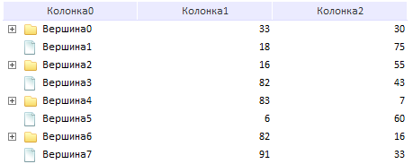

# Пример динамического создания компонента TreeList

Пример динамического создания компонента TreeList
-

# Пример динамического создания компонента TreeList

Компонент TreeList поддерживает
 возможность динамического добавления данных. На странице приведен пример
 добавления данных в уже созданное дерево.

Для выполнения примера в теге HEAD подключите ссылки на библиотеку компонентов
 PP.js и таблицы визуальных стилей PP.css. В корневом каталоге должен содержаться
 файл с наименованием «treeImagesIcons.png».

    // Исходные данные
    var columns = 3;// Число столбцов
    var nodes = 8; //Число вершин-родителей
    var columnWidth = 150;// Ширина столбцов
    var depth_limit = 2;// Максимальная "глубина" дерева
    var subnodes = 2;// Число динамически создаваемых вершин
    // Создаем экземпляр компонента TreeList:
    component = new PP.Ui.TreeList(
        {
            Height: 800,
            Width: columns * columnWidth,
            ParentNode: container,

            ImageList: new PP.ImageList({ Source: 'ltreeImagesIcons.png', IconHeight: 20, IconWidth: 18 }),
            ShowLines: false,
            MultiSelect: true,
            RowSelect: true,
            EnableResizeColumn: false,
            ShowColumns: true,
            CaptionVisible: true,
            EnableColumnsMenu: false,

            Columns: generateColumns(columns), // получаем массив из JSON-объекта, который описывает столбцы
            Nodes: generateNodes(nodes)//получаем массив из JSON-объекта, который описывает вершины
        });
   //Обработчик события выбора вершины, имеющей потомков
   component.LoadSubNodesOf.add(onLoad);
    //Генерация столбцов
    function generateColumns(n) {
        var arrColumns = []
        for (var i = 0; i < n; i++)
            arrColumns.push({ Caption: "Столбец" + i, Width: columnWidth, MinWidth: 10, Visible: true });
        return arrColumns;
    }

    //Генерация вершин
    //дочерние вершины будут динамически подгружаться в каждую нечетную вершину родителя
    function generateNodes(n) {
        var arrNodes = [];
        for (var i = 0; i < n; i++) {
            var node = { Text: "Вершина" + i, Columns: generateValues() };// Columns ожидает получить массив из значений
            if (i % 2 == 0)//отбираем четные вершины c учетом того, что нумерация начинается с 0
                node.HasChild = true;//определяем, что у отобранных вершин будут дочерние вершины
            arrNodes.push(node);
        }

        return arrNodes;
    }
    //Генерация значений
    function generateValues() {
        var arrValues = [];
        for (var i = 0; i < columns; i++) // Число значений должно быть <= числу столбцов
            arrValues.push(Math.floor(Math.random() * 100));
        return arrValues;
    }

    //Функция, которая будет обрабатывать подгрузку дочерних вершин
    function onLoad(data, args) {
        var arrChildNodes = generateNodes(subnodes);//сгенерированный JSON-объект с описанием вершин
        var node = args.Node;
        if (component.getNodeLevel(node) > depth_limit)//Прерываем бесконечную подгрузку проверкой уровня вершины
            node.setHasChild(false);// Если уровень достигнут, то устанавливаем для свойства HasChild значение false,тем самым даем сигнал, что у вершины больше не будет дочерних элементов
        else
            node.getNodes().loadFrom(arrChildNodes);// если глубинный лимит не исчерпан, то вызываем метод loadFrom у объекта PP.Ui.TreeNodes и передаем ему созданный массив вершин.
    };

После выполнения примера будет создан компонент TreeList,
 имеющий следующий вид:

См. также:

[TreeList](TreeList.htm)

		Справочная
		 система на версию 10.9
		 от 18/08/2025,
		 © ООО «ФОРСАЙТ»,
