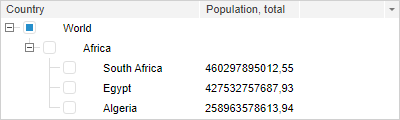

# Пример создания компонента TreeList

Пример создания компонента TreeList
-

# Пример создания компонента TreeList

Перед выполнением примера ознакомьтесь с [рекомендациями](dhtml.chm::/specification/JavaScript_main.htm)
 к написанию кода. На одном уровне с html-страницей должен содержаться
 файл с наименованием treeImagesIcons.png.

Для создания компонента [TreeList](TreeList.htm) используйте
 HTML-код:

<!DOCTYPE html PUBLIC "-//W3C//DTD XHTML 1.0 Transitional//EN" "http://www.w3.org/TR/xhtml1/DTD/xhtml1-transitional.dtd">
<html>
<head>
    <meta http-equiv="X-UA-Compatible" content="IE=edge" />
    <meta http-equiv="Content-Type" content="text/html; charset=UTF-8">
    <title>TreeList</title>
    
    <link href="../build/PP.css" rel="stylesheet" type="text/css" />
</head>
<body>
    

    
</body>
</html>

В результате выполнения примера на html-странице будет размещен компонент
 [TreeList](TreeList.htm):

См. также:

[TreeList](TreeList.htm)

		Справочная
		 система на версию 10.9
		 от 18/08/2025,
		 © ООО «ФОРСАЙТ»,
